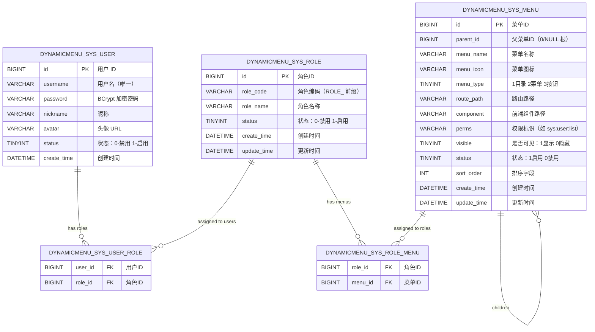
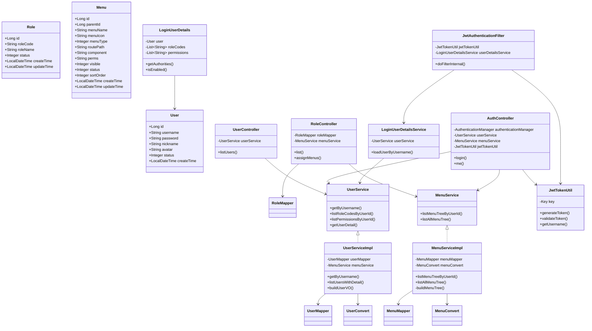
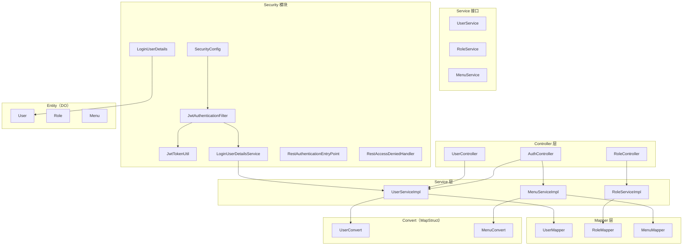
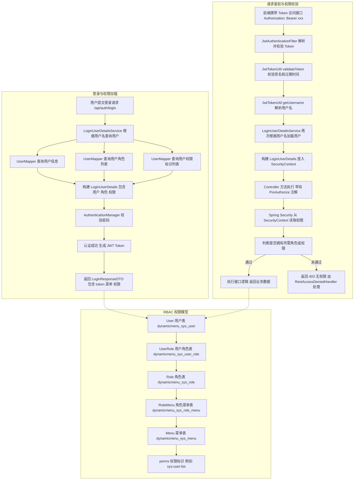
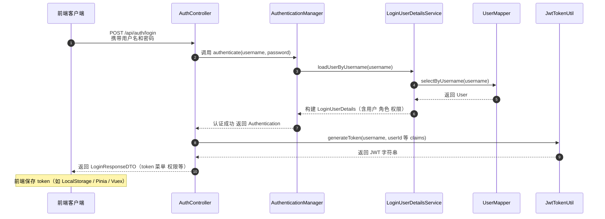
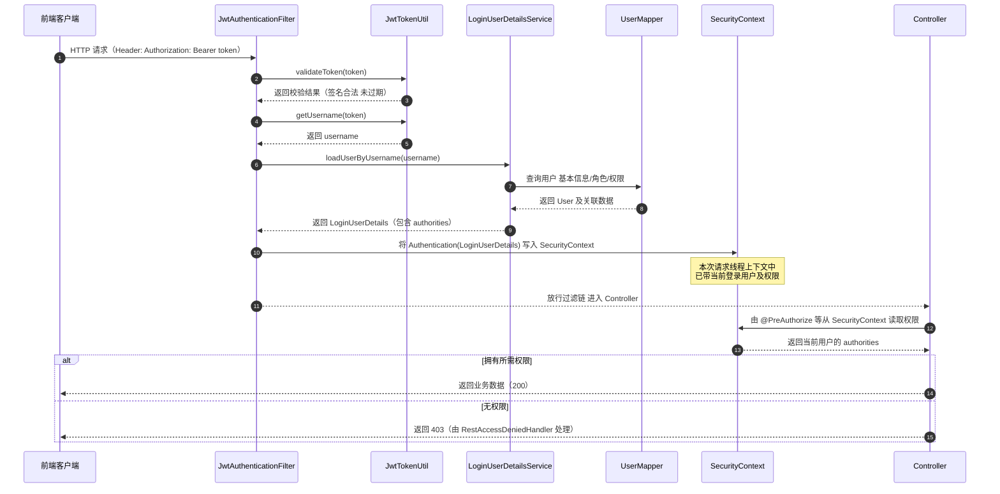

# Dynamic Menu Permission System (基于 Spring Boot 的动态菜单权限系统)

基于 **Spring Boot 3 + Spring Security + JWT + MyBatis-Plus** 实现的
**后端 RBAC 权限管理系统**，支持：

-   ✔ 动态菜单（多角色合并）
-   ✔ 按钮级权限（perms 标识）
-   ✔ JWT 无状态认证
-   ✔ 角色授权（菜单树勾选）
-   ✔ 用户管理
-   ✔ 分层清晰的可扩展架构

适合作为后台系统、SaaS 管理平台等项目的通用权限模块。

---

## 技术栈

| 技术              | 说明               |
| ----------------- | ------------------ |
| Spring Boot 3.x   | 主框架             |
| Spring Security 6 | 身份认证与权限控制 |
| JWT               | Token 认证         |
| MyBatis-Plus      | 数据持久层         |
| MapStruct         | DO/VO 转换         |
| Lombok            | 简化实体类         |
| Logback           | 日志系统           |
| Maven             | 构建工具           |
| VSCode            | 推荐开发 IDE       |

---

## 功能清单

### 认证授权

-   用户登录（JWT）
-   Token 校验过滤器（JwtAuthenticationFilter）
-   无状态会话（SessionCreationPolicy.STATELESS）
-   自定义 401/403 处理器

### 用户管理

-   用户列表（附带角色、权限、菜单树）
-   查询用户详情
-   获取当前登录用户（/api/auth/me）

### 角色管理

-   角色增删改查
-   角色绑定菜单（多选树）
-   查询角色菜单

### 菜单管理（核心）

-   支持目录 / 菜单 / 按钮（menuType=1/2/3）
-   动态菜单树生成（按用户 → 多角色 → 菜单）
-   系统全量菜单树（后台管理用）
-   多角色合并去重
-   菜单排序（sortOrder）

---

## 项目结构

```text
src/
 ├── main/
 │   ├── java/net/wcloud/helloworld/dynamicmenu/
 │   │   ├── common/                 # 通用返回结构 Result
 │   │   ├── config/                 # 安全 + JWT + 日志配置
 │   │   ├── controller/             # 控制器
 │   │   ├── convert/                # MapStruct 转换器
 │   │   ├── dto/                    # 请求/响应 DTO
 │   │   ├── entity/                 # 实体类
 │   │   ├── mapper/                 # MyBatis-Plus Mapper + 注解 SQL
 │   │   ├── security/               # Security + JWT + UserDetails
 │   │   ├── service/                # 服务接口
 │   │   └── service/impl/           # 服务实现
 │   └── resources/
 │       ├── application.yaml        # 配置文件（UTF-8）
 │       ├── logback-spring.xml      # 日志配置（UTF-8）
 │       └── mapper XML（如果有）
 └── test/                           # 单元测试
```

---

## ER 图



---

## 类图



---

## 模块图



---

## 流程图

### 权限体系流程图（用户 → 角色 → 菜单 → perms）



### JWT 鉴权流程图

#### 登录发 Token 流程



#### 携带 Token 访问受保护接口的鉴权流程


